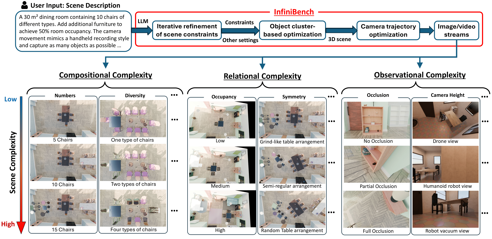
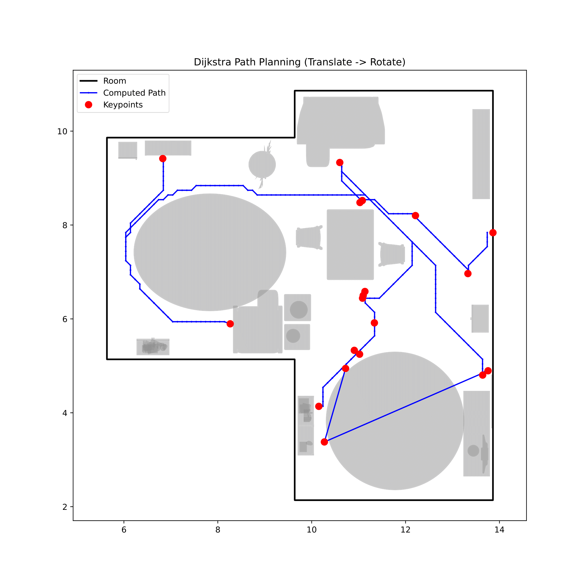

# [InfiniBench:  Infinite Benchmarking for Visual Spatial Reasoning with Customizable Scene Complexity](https://arxiv.org/pdf/2511.18200)

Modern vision-language models (VLMs) are expected to have abilities of spatial reasoning with diverse scene complexities, but evaluating such abilities is difficult due to the lack of benchmarks that are not only diverse and scalable but also fully customizable. We present InfiniBench, a fully automated, customizable and user-friendly benchmark generator that can synthesize a theoretically infinite variety of 3D scenes with parameterized control on scene complexity. InfiniBench uniquely translates scene descriptions in natural language into photo-realistic videos with complex and physically plausible 3D layouts. This is achieved through three key innovations: 1) a LLM-based agentic framework that iteratively refines procedural scene constraints from scene descriptions; 2) a flexible cluster-based layout optimizer that generates dense and cluttered scenes previously intractable for procedural methods; and 3) a task-aware camera trajectory optimization method that renders scenes into videos with full object coverage as VLM input.

<div style="text-align: center;">
  
</div>

This document captures the additions layered on top of stock InfiniBench: agentic constraint generation, cluster-aware solvers, and both frontier and notebook-style camera trajectory optimizers. Some pre-generated examples can be found in this [Huggingface repo](https://huggingface.co/datasets/Haoming645/infinibench) Start with Step 0 to install the codebase, then jump to the feature you care about.


## Quickstart (Text ➜ Scene ➜ Video ➜ QA )

1. **Install + deps.** Follow Step 0 below 
2. **Provide an LLM.** Install `openai` (`pip install openai`) and export:
   ```bash
   export OPENAI_API_KEY=sk-...              # or your Azure/OpenAI compatible key
   export INFINIBENCH_AGENTIC_LLM=openai
   export INFINIBENCH_OPENAI_MODEL=gpt-4o-mini
   ```
   Skip the env vars if you want to fall back to the bundled `DummyLLM`.
3. **Run the end-to-end script.** This drives Blender for scene + trajectory generation, builds QA tasks:
   ```bash
   python infinigen_examples/run_end_to_end.py \
     --scene-description "compact studio apartment with plants" \
     --output-root /path \
   ```
4. **Inspect outputs.** The script creates a timestamped folder under `runs/` with:
   - `scene/scene.blend` – the generated environment.
   - `trajectory/scene/trajectory_frame_*.png` + `trajectory_video.mp4` – renders of the optimized path.
   - `trajectory/scene/object_*.csv` – metadata consumed by QA generation.
   - `qa/qa_tasks.json` – measurement/perspective/spatiotemporal prompts.


See the next section for more knobs (seeds, ffmpeg options, response format, etc.).

## End-to-End Pipeline Script

`infinigen_examples/run_end_to_end.py` exposes the entire reproducibility chain via one command. Key flags:
- `--scene-description` (required) and `--disable-agentic` toggle whether the agent translates prose into constraints.
- `--blender /path/to/blender` selects the Blender binary; all stages run headless.
- Trajectory controls such as `--frame-prefix`, `--trajectory-samples`, `--trajectory-grid`, and `--trajectory-resolution` are forwarded to `trajectory_optimizer.py`'s batch pipeline.
- QA sampling knobs (`--measurement-tasks`, `--perspective-tasks`, `--spatiotemporal-tasks`, `--qa-seed`).
- `--responses predictions.json` enables metric computation. The JSON can either map task ids to predictions or contain a `responses` array with `{"id": "task_0000", "prediction": 2.1}` entries.
- `--ffmpeg-bin` / `--video-fps` control how rendered frames are converted to `trajectory_video.mp4` (frames remain available even if ffmpeg is missing).

The script is idempotent and safe to re-run with different descriptions or seeds; each invocation writes to a fresh directory unless `--output-root` is provided.


---

## Step 0 – Install Infinigen (Linux x86_64, Python Module)

Our work builds on [Infinigen](https://github.com/princeton-vl/infinigen). The workflow below mirrors the “Installing Infinigen as a Python Module”, trimmed to the Linux x86_64 path that powers InfiniBench. 

```bash
# System dependencies (Ubuntu / Debian / WSL / other Linux x86_64 distros)
sudo apt-get install wget cmake g++ libgles2-mesa-dev libglew-dev libglfw3-dev libglm-dev zlib1g-dev

# Clone Infinigen and create a Conda env
git clone https://github.com/princeton-vl/infinigen.git
cd infinigen
conda create --name infinigen python=3.11
conda activate infinigen

# Minimal install (good for InfiniBench + Infinigen-Indoors)
INFINIGEN_MINIMAL_INSTALL=True pip install -e .

# Or enable terrain + OpenGL GT if you need full-scene generation
pip install -e ".[terrain,vis]"
```


## 1. Cluster-Based Layout Optimization


<p align="center">
  
</p>


**Key files**
- `infinigen/core/constraints/example_solver/clusters.py`
- `infinigen/core/constraints/example_solver/moves/cluster.py`
- `infinigen/core/constraints/example_solver/propose_clusters.py`
- `infinigen/core/constraints/example_solver/solve.py`

**What changed**
- Furniture supported by a common parent (e.g., chairs around a table) is auto-grouped using `StableAgainst` relations.
- New moves (`cluster_translate`, `cluster_rotate`, `cluster_resample`) treat each cluster as a rigid body when exploring layouts.
- Collision tests first evaluate a cluster-level AABB to avoid expensive per-object checks when an entire move is invalid.

**How to use**
- Cluster moves are enabled by default during `Solver.solve_objects`.
- To constrain the search space, add a gin override (example):
  ```gin
  Solver.restrict_moves = ["addition", "cluster_translate", "cluster_rotate"]
  ```
- Logging continues to flow through `infinigen.core.constraints.example_solver.solve`, so existing tooling still works.

---

## 2. Agentic Constraint Generation


<p align="center">
  
</p>


**Key files**
- `infinigen_examples/constraints/agentic_framework.py`
- `infinigen_examples/generate_indoors.py`

**Highlights**
- `AgenticConstraintGenerator` stitches together prompt templates, API docs, and in-context examples (default: `home_furniture_constraints`).
- `AgenticSceneGenerator` loops over {generate → compile → validate → optional feedback} to enforce chain-of-thought refinement.
- `compose_indoors()` accepts new CLI flags:
  - `scene_description`: natural-language description (“cozy studio with plants”).
  - `use_agentic_constraints`: toggle the agent on/off.
  - `agentic_max_iterations`: bound retries when compilation fails or the optimizer requests changes.

**Example**
```bash
python infinigen_examples/generate_indoors.py \
    --scene_description "compact studio apartment with plants and wall art" \
    --output_folder path\to\scene \
    --use_agentic_constraints True \
    --agentic_max_iterations 3 \
    -p solve_steps_large=400
```

Behind the scenes, the agent produces Python, compiles it via `agentic_result.final_program.to_callable(...)`, and injects the resulting constraint builder into the standard greedy + simulated annealing loop.

**Using a real LLM client**
- Set `INFINIBENCH_AGENTIC_LLM=openai`, `INFINIBENCH_OPENAI_MODEL=<model-id>`, and `OPENAI_API_KEY` (plus `INFINIBENCH_OPENAI_BASE_URL` if you route through Azure or another gateway). `compose_indoors()` automatically picks up those variables and instantiates the `OpenAIChatClient` shim defined in `agentic_framework.py`.
- To plug in another provider, implement the `LLMClient` protocol and pass it to `build_default_agentic_generator()` (e.g., via a gin-configured factory). Only `complete(prompt: str) -> str` is required.
- Falling back to the default `DummyLLM` simply replays the in-context example and is only useful for debugging the compilation loop.

---

## 3. Camera Trajectory Optimization

<p align="center">
  
</p>


**File**: `infinigen_examples/trajectory_optimizer.py`

The module now exposes two complementary pipelines. Choose the one that matches your workflow.


- Implements the four-step frontier loop:
  1. Pick the closest unvisited target object.
  2. Sample viewpoints (accessibility, FoV coverage, occlusion) around it.
  3. Run Dijkstra on a 2D navigation grid (constant camera height).
  4. Append translation + rotation poses to the trajectory.
- Outputs a JSON list of `{position, rotation_euler}` entries ready for downstream consumers.

**CLI**
```bash
blender --background --python infinigen_examples/trajectory_optimizer.py -- \
    --blend /path/to/scene.blend \
    --output /tmp/trajectory.json \
    --samples 1500 \
    --grid 0.6
```

**Helpful flags**
- Sampling space: `--batch-height`, `--batch-min-distance`, `--batch-max-distance`, `--batch-max-sight`.
- Visibility: `--batch-occlusion`, `--batch-occlusion-checks`.
- Rendering: `--batch-frame-prefix`, `--batch-frame-step`, `--batch-resolution`, `--batch-video-name`.
- Navigation safety: `--batch-robot-radius`.

   
     <br>

**The optimized trajectory should look like this:**
<p align="center">
  
</p>


---

## 4. QA Task Generation from Trajectory Metadata

**File**: `infinigen_examples/qa_from_metadata.py`

After running the batch trajectory pipeline, each output directory contains metadata CSVs (`object_bbox_dimensions.csv`, `object_appearance.csv`, etc.). Use the QA generator to synthesize evaluation tasks for multimodal models:

```bash
python infinigen_examples/qa_from_metadata.py \
    --metadata-dir /data/trajectories/scene_001 \
    --output /data/trajectories/scene_001/qa_tasks.json \
    --measurement-tasks 5 \
    --perspective-tasks 5 \
    --spatiotemporal-tasks 3 \
    --seed 42
```

**Task families**
- **Measurement tasks** ask for precise dimensions with contextual cues (e.g., “What’s the height of the oak cabinet next to the sofa?”) and are scored with mean relative accuracy.
- **Perspective-taking tasks** pose counting questions conditioned on the rendered trajectory (mean relative accuracy).
- **Spatiotemporal tasks** request the appearance order of multiple objects across the trajectory video and are evaluated via exact-match accuracy.

Each run emits a JSON payload describing the prompts, answers, and evaluation metrics, making it easy to integrate into auto-grading pipelines.

### Metric Definitions
- **Mean relative accuracy (MRA)** is `1 - |prediction - target| / max(|target|, ε)` averaged over all measurement or perspective tasks. We use `ε = 1e-3` for measurement prompts (to avoid division by zero when values are tiny) and `ε = 1.0` for perspective/counting prompts. Scores are clipped to `[0, 1]`.
- **Exact-match accuracy** counts a spatiotemporal response as correct only when the predicted ordering string matches the ground truth after lowercasing and trimming whitespace. The final score is the fraction of exact matches across the task set.

`run_end_to_end.py` writes these summaries to `metrics.json` when a predictions file is supplied via `--responses`.

---

## Acknowledgments

Our code builds on ([infinigen](https://github.com/princeton-vl/infinigen)).  
We are grateful to the authors for their work and contributions.

If you use this repository, make sure to also review and comply with the licensing terms of the original project.

 ## Citation
 ```
@article{wang2025infinibench,
  title={InfiniBench: Infinite Benchmarking for Visual Spatial Reasoning with Customizable Scene Complexity},
  author={Wang, Haoming and Xue, Qiyao and Gao, Wei},
  journal={arXiv preprint arXiv:2511.18200},
  year={2025}
}
 ```
